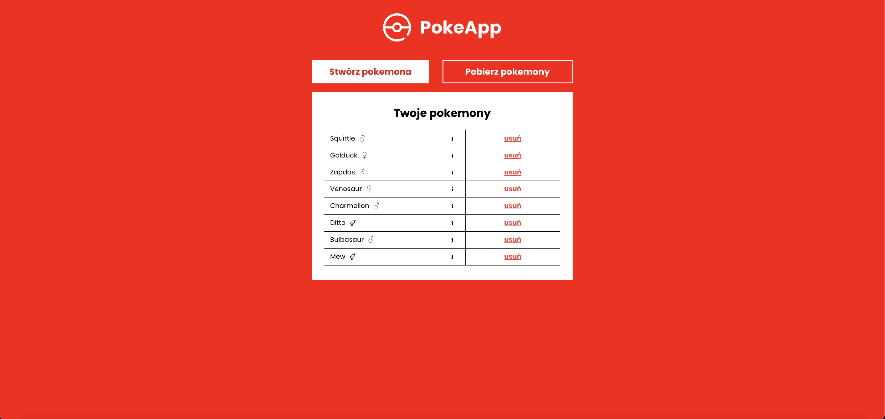
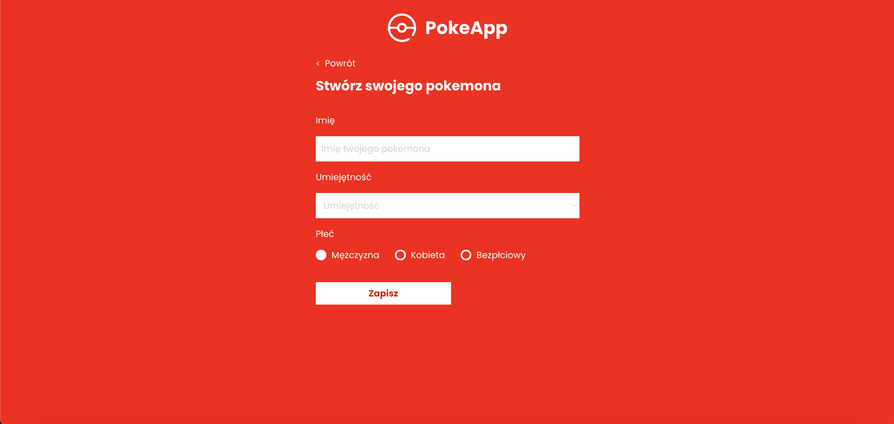

# PokeApp-rekrutacja

## Opis projektu

Aplikacja Pokemon to projekt rekrutacyjny, który demonstruje połączenie frontendowej aplikacji Next.js z backendowym API stworzonym w NestJS. Aplikacja korzysta z bazy danych PostgreSQL do przechowywania danych o Pokemonach.

## Screenshoty

### Strona główna



### Formularz dodawania pokemona



## Technologie

- **Frontend**: Next.js, TypeScript
- **Backend**: NestJS, TypeScript, PostgreSQL

## Instrukcje uruchomienia

### Backend 

1. Sklonuj repozytorium:

   ```bash
   git clone https://github.com/HuminPiotr/pokeApp-rekrutacja.git
   ```

2. Przejdź do katalogu projektu:
```bash
cd your-repo/poke-api
```

3. Skopiuj plik example.env jako .env i uzupełnij dane do połączenia z bazą danych:
```bash
cp example.env .env
```

4. Zainstaluj zależności
```bash
npm install 
```

5. Uruchom aplikacje backendową:
```bash
npm run start:dev

```
### Frontend 

1. Przejdź do katalogu projektu:
```bash
cd ../frontend
```

2. Skopiuj plik example.env jako .env i uzupełnij dane do połączenia z bazą danych:
```bash
cp example.env .env
```

3. Zainstaluj zależności
```bash
npm install 
```

5. Uruchom aplikacje backendową:
```bash
npm run dev
```


